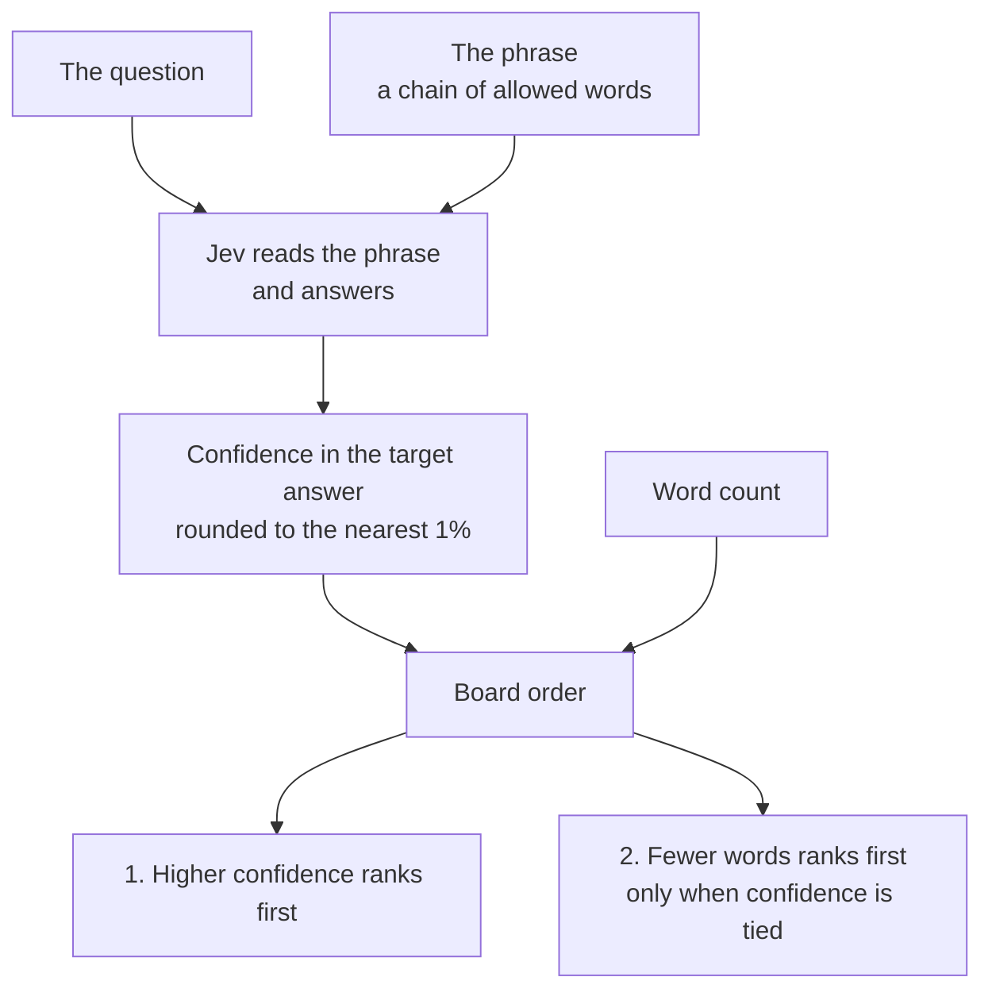
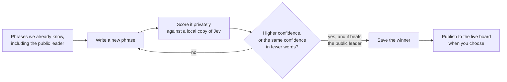

# jevlab

**An offline search lab for playing [Trick Jev](https://trickjev.com).**

Trick Jev poses a question. A player answers with a phrase, and Jev, a language model, reads that phrase and reports how sure it is of an answer. jevlab searches for the phrases that rank highest, on your own machine, and holds the winners until you choose to publish them on the public leaderboard.

[](docs/screenshots/lab.png)
[](docs/screenshots/search.png)

## Strict Highest

**Strict Highest** is the main board. Two rules decide the order, and they are applied in that order:

1. **Higher confidence wins.** Jev's confidence in the target answer is rounded to the nearest percentage point. A phrase at 99% always ranks above a phrase at 98%.
2. **Fewer words breaks a tie.** When two phrases round to the same confidence, the shorter one ranks higher.

A shorter phrase never overtakes a higher score. Length matters only after the rounded confidence is equal.



The same two facts decide whether a new phrase is worth keeping. The numbers below are an illustration, not a live board:

| Phrase | Confidence | Words | Where it ranks |
| --- | --- | --- | --- |
| a long argument that cereal counts as soup | 99% | 40 | Second. Same confidence as the line below, but longer. |
| soup | 99% | 1 | First. Same confidence, fewer words. |
| breakfast | 98% | 1 | Third. One point lower, so the short length does not help. |

### What a search does

A Strict Highest search rehearses that ranking in private. jevlab starts from phrases it already knows, writes new ones, and asks a local copy of Jev how confident it is. A phrase is saved only when it would outrank the current public leader. Publishing that phrase onto the live board is a separate step.



The lab also plays **Strict Shortest yes**, a different board: a phrase only has to convince Jev, just over 50%, and the shortest convincing phrase wins. The diagram above is Strict Highest.

The wording rules, the noise in Jev's answers, and how the search proposes and checks phrases are in [docs/how-it-works.md](docs/how-it-works.md).

## Get started

```bash
uv sync
cp .env.example .env        # add your OPENROUTER_API_KEY
uv run jevlab snapshot
uv run jevlab lab --q is-cereal-a-soup
```

See [QUICKSTART.md](QUICKSTART.md) for the full walkthrough: installation, the first search, the vault, publishing, and the Kev, Laya, and Clef editions.

## Documentation

| Doc | Contents |
| --- | --- |
| [QUICKSTART.md](QUICKSTART.md) | Install, configure, and run everything |
| [docs/how-it-works.md](docs/how-it-works.md) | Technical summary: why Jev is hard to read, and how the search is built |
| [docs/commands.md](docs/commands.md) | Every command and flag |
| [docs/configuration.md](docs/configuration.md) | Model roles, swapping models, costs, Jev vs Kev vs Laya vs Clef |
| [docs/architecture.md](docs/architecture.md) | Full engine write-up, with the math, plus a source map |
| [scripts/README.md](scripts/README.md) | Research scripts and benchmarks |

## Be a good guest

Trick Jev is someone's hobby project. jevlab does its searching offline precisely so it doesn't hammer the site, so keep it that way: snapshot occasionally, keep the default publish delays, and remember that `jevlab publish` plays real turns on a public leaderboard.

## License

[MIT](LICENSE)
