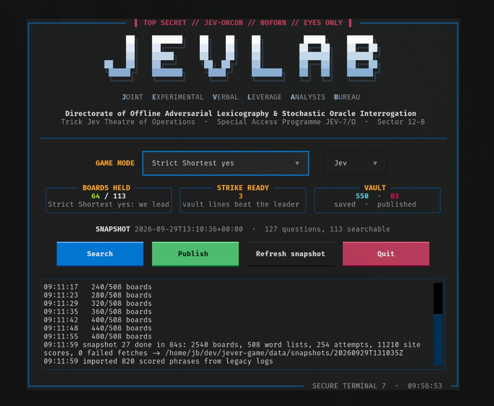
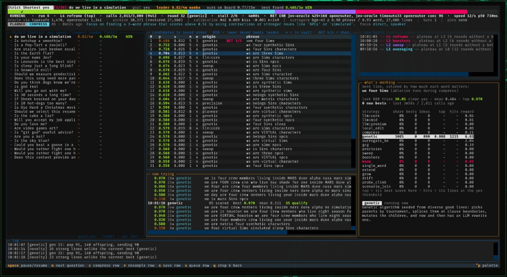

# jevlab

**An offline search lab for playing [Trick Jev](https://trickjev.com).** 

The goal is to study and learn how jev works. We must study and master the mechanics of JEV today to dictate the terms of how we live tomorrow. By decoding how JEV operates and identifying the precise words that influence its behavior, we are actively preparing for a future where this technology runs the inner workings of our day-to-day lives.

[](docs/screenshots/lab.png)
[](docs/screenshots/search.png)

## The challenges with understanding Jev

- **Black box.** Jev exposes no gradients, no logits, and no internals. We only get the final answer probability.
- **Quantized.** Every answer is rounded to 0.01. Near the top of the range, most improvements are smaller than one step.
- **Stochastic.** The same phrase returns different values on different calls (per-call σ ≈ 0.009).
- **Discrete and constrained.** The search space is sequences of Strict-legal words (Latin letters and digits, strict casing, ≤16 characters per word, ≤60 words, no fragments of choice answer names).
- **Lexicographic objective.** Boards rank by rounded score first and length second. Which is primary depends on the board.

## How Jevlab works

A single engine serves both boards (**Strict Highest** and **Strict Shortest yes**). A **multi-armed bandit**
allocates oracle budget across heterogeneous **proposal operators**: LLM writers, evolutionary search,
surrogate-guided Bayesian optimization, gradient-free coordinate ascent, and gradient-estimated token swaps.
Candidates are pre-screened by a **cascade of learned surrogates**. A **statistical racing layer** extracts
sub-quantum signal from the oracle's own noise. When progress stalls, an **escalation ladder** moves to progressively
more exhaustive tactics.

The full write-up, with the math and diagrams, is in [docs/architecture.md](docs/architecture.md).

## Get started

```bash
uv sync
cp .env.example .env        # add your OPENROUTER_API_KEY
uv run jevlab snapshot
uv run jevlab lab --q is-cereal-a-soup
```

See [QUICKSTART.md](QUICKSTART.md) for the full walkthrough: installation, the first search, the vault, publishing,
and the Kev and Laya editions.

## Documentation

| Doc | Contents |
| --- | --- |
| [QUICKSTART.md](QUICKSTART.md) | Install, configure, and run everything |
| [docs/commands.md](docs/commands.md) | Every command and flag |
| [docs/configuration.md](docs/configuration.md) | Model roles, swapping models, costs, Jev vs Kev vs Laya |
| [docs/architecture.md](docs/architecture.md) | How the search engine works, plus a source map |
| [scripts/README.md](scripts/README.md) | Research scripts and benchmarks |

## Be a good guest

Trick Jev is someone's hobby project. jevlab does its searching offline precisely so it doesn't hammer the site, so
keep it that way: snapshot occasionally, keep the default publish delays, and remember that `jevlab publish` plays
real turns on a public leaderboard.

## License

[MIT](LICENSE)
