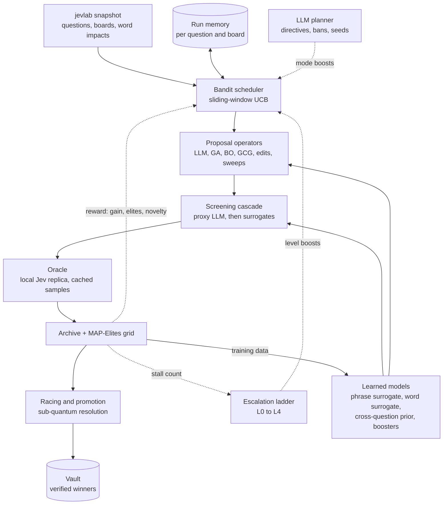
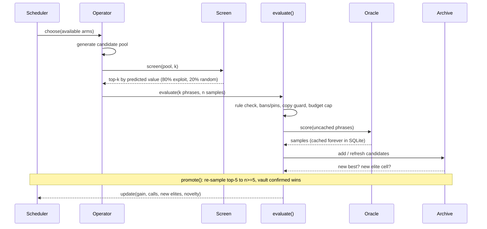
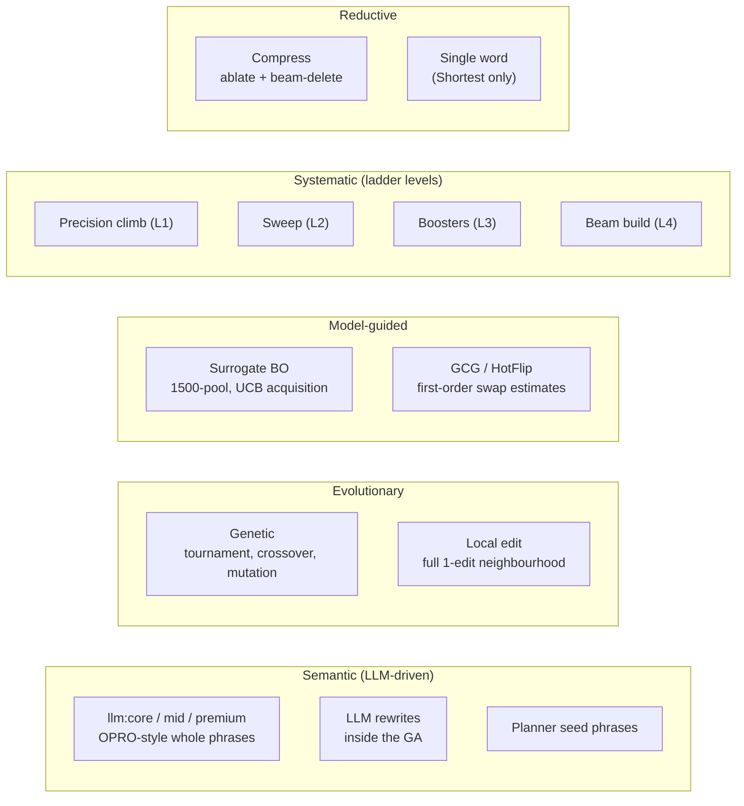
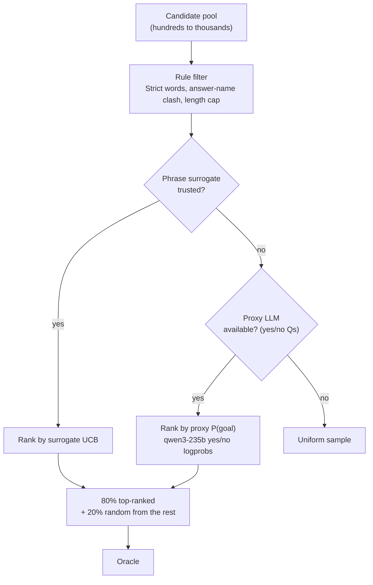
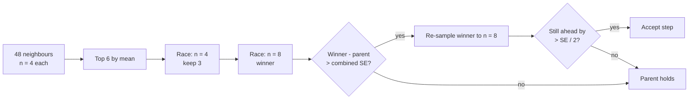
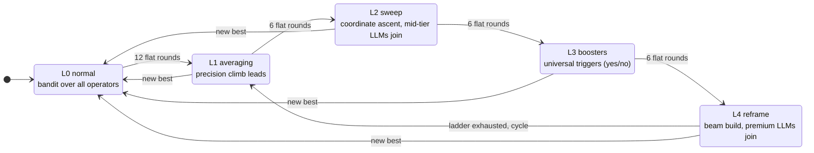
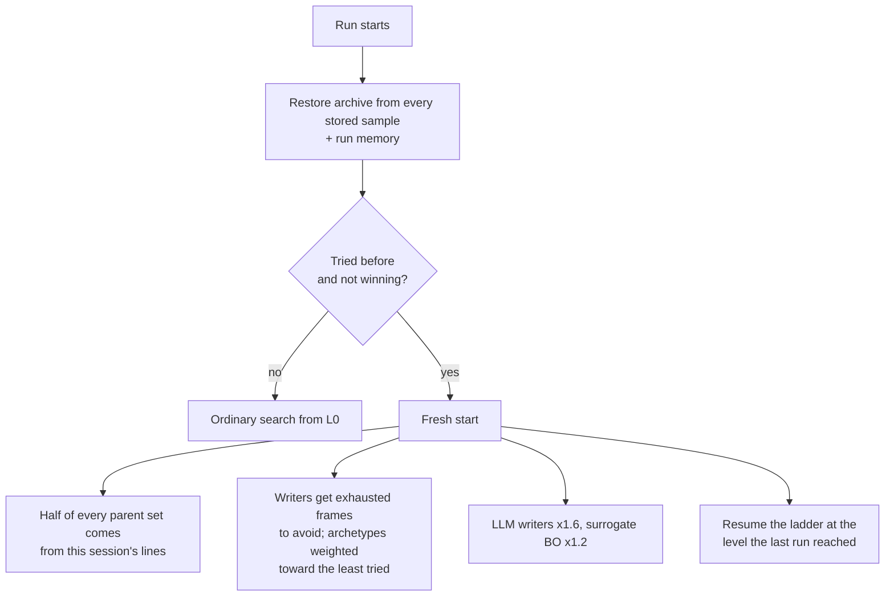

# jevlab architecture: search against a quantized, stochastic classifier

`jevlab` is an offline optimization lab for [Trick Jev](https://i-wanna-date-jev.begin-363.workers.dev). Players build phrases, and Jev, a classifier language model, reads each phrase as context and answers a question. The goal is to push Jev's probability for a target answer as high as it will go, using as few words as possible.

From an optimization point of view the game is unusually hostile:

- **Black box.** Jev exposes no gradients, no logits, and no internals. We only get the final answer probability.
- **Quantized.** Every answer is rounded to 0.01. Near the top of the range, most improvements are smaller than one step.
- **Stochastic.** The same phrase returns different values on different calls (per-call σ ≈ 0.009).
- **Discrete and constrained.** The search space is sequences of Strict-legal words (Latin letters and digits, strict casing, ≤16 characters per word, ≤60 words, no fragments of choice answer names).
- **Lexicographic objective.** Boards rank by rounded score first and length second. Which is primary depends on the board.

The system attacks this with a single unified engine. A **multi-armed bandit** allocates oracle budget across heterogeneous **proposal operators**: LLM writers, evolutionary search, surrogate-guided Bayesian optimization, gradient-free coordinate ascent, and gradient-estimated token swaps. Candidates are pre-screened by a **cascade of learned surrogates**. A **statistical racing layer** extracts sub-quantum signal from the oracle's own noise. When progress stalls, an **escalation ladder** moves to progressively more exhaustive tactics.

This document explains that engine once, end to end. The two boards it competes on, **Strict Highest** and **Strict Shortest yes**, share almost all of it. Where they diverge, the difference is called out inline like this:

> **Shortest yes:** what changes on the Shortest yes board, and why.

---

## Contents

1. [The problem, formally](#1-the-problem-formally)
2. [System architecture](#2-system-architecture)
3. [The oracle: a local replica of Jev](#3-the-oracle-a-local-replica-of-jev)
4. [Fitness shaping](#4-fitness-shaping)
5. [The archive and MAP-Elites diversity](#5-the-archive-and-map-elites-diversity)
6. [The bandit scheduler](#6-the-bandit-scheduler)
7. [Proposal operators](#7-proposal-operators)
8. [The screening cascade](#8-the-screening-cascade)
9. [Sub-quantum resolution: reading signal from noise](#9-sub-quantum-resolution-reading-signal-from-noise)
10. [The escalation ladder](#10-the-escalation-ladder)
11. [Promotion, verification, and the vault](#11-promotion-verification-and-the-vault)
12. [Plateau mode](#12-plateau-mode)
13. [Cross-run memory and fresh starts](#13-cross-run-memory-and-fresh-starts)
14. [Experimental: the long-chain regime](#14-experimental-the-long-chain-regime)
15. [Highest vs Shortest at a glance](#15-highest-vs-shortest-at-a-glance)
16. [Source map](#16-source-map)

---

## 1. The problem, formally

For a question $q$ with goal answer $g$, the oracle returns a noisy, rounded value

$$
J(x) = \operatorname{round}_{0.01}\big(P_{\text{Jev}}(g \mid x, q) + \varepsilon\big), \qquad \varepsilon \sim \mathcal{N}(0, \sigma^2(p)),
$$

where $x$ is a phrase of $u(x)$ words. When the goal is "no", the engine flips every value ($p \mapsto 1 - p$), so everything downstream maximizes $P(\text{goal})$. For choice questions, the value is Jev's top-option probability, or $P(\text{target})$ when a run is aimed at one answer with `--target`.

On **Strict Highest**, the board orders lines lexicographically by

$$
\text{key}_{\text{H}}(x) = \big(\operatorname{round}(p),\; -u(x)\big).
$$

A higher rounded score always wins. Length only breaks ties.

> **Shortest yes:** the order flips. A line has to *qualify* first: $P(\text{goal}) > 0.5$ on the site, and ≥ 0.51 internally so that noise cannot drop it under. Among qualifying lines, fewer words win, and the rounded score breaks ties:
>
> $$\text{key}_{\text{S}}(x) = \big(\mathbb{1}[p \ge 0.51],\; -u(x),\; \operatorname{round}(p)\big).$$
>
> Most Shortest boards are led by one- or two-word lines, so the search tilts hard toward the very short end of the space.

The objective is defined once in `jevlab/objective.py` (`Objective.key`, `score_key`, `beats`, `wins`). Every other component asks the `Objective` what "better" means instead of hard-coding it. That single seam is what lets one engine serve both boards.

---

## 2. System architecture



A **round** is one pull of the bandit. The scheduler picks an operator, the operator proposes phrases and scores them through the shared `evaluate()` gate, the leaders are re-sampled, and the scheduler is credited with whatever the round achieved.



---

## 3. The oracle: a local replica of Jev

Searching against the live site would be slow, rate-limited, and public. Instead, `jevlab/oracle.py` sends **the exact request body the site sends** (each question's `jevRequest`, with our phrase as `state`) straight to Jev's `/systemone` endpoint. Calls are pooled across Typesafe's API and OpenRouter.

Parity was measured by replaying phrases the site had already scored (`jevlab calibrate`):

| Metric (249 site-scored phrases) | Value |
| --- | --- |
| Pearson r, oracle vs site | 0.999 |
| Mean absolute error | 0.0089 |
| Bias | −0.0006 |
| Within ±0.02 | 92% |
| Per-call noise σ | 0.0090 |

The MAE is the same size as the per-call noise. Under calibration, the replica is indistinguishable from the site.

Three engineering choices make the oracle a durable asset rather than a cost center:

- **Every sample is kept forever.** Samples are keyed by a SHA-256 of the request body. `score(states, n)` only *tops up* each phrase to $n$ samples, so re-sampling a leader never repeats work, and every run on a question restores the full history of everything ever scored there. At the time of writing, the store holds about 1.18M samples over 976k distinct phrases on 126 questions.
- **AIMD concurrency per backend.** Each backend grows its concurrency additively on success and halves it on failure, at most once per two-second window, so a burst of in-flight failures counts as one congestion signal. A backend that fails three times in a row rests while the others carry the load. A 401/402/403 takes a backend out permanently.
- **Samples are shared across boards.** A phrase scores the same wherever it is published, so a Highest run's history seeds a Shortest run for free, and the reverse.

---

## 4. Fitness shaping

The board key is lexicographic and piecewise-flat, which gives a search almost nothing to climb. The engine therefore optimizes a shaped scalar **fitness** that is order-consistent with the board key but has usable gradient everywhere (`Objective.fitness`).

On **Highest**:

$$
f_{\text{H}}(x) = \operatorname{logit}(p) \;-\; 0.004 \cdot \max\!\big(0,\; u(x) - u_{\text{lead}} + 1\big).
$$

- **Logit, not probability.** Between 0.97 and 0.99 the raw probability barely moves, but the logit keeps expanding: $\operatorname{logit}(0.99) - \operatorname{logit}(0.97) \approx 1.12$. The search keeps a strong signal right up to the ceiling.
- **Par-relative length penalty.** Length only matters on ties, and a tie can only matter once we are near the leader's length. So length is free up to one word under the leader ($u_{\text{lead}}$), and the penalty is small enough never to outweigh a real score gain. Early in the search this lets lines grow as long as they need to.

> **Shortest yes:** fitness becomes a three-tier ladder around the 0.51 threshold. With $\text{gap} = \operatorname{logit}(p) - \operatorname{logit}(0.51)$ and $B(u) = 2 + 0.2 \cdot \max(60 - u, 0)$:
>
> $$
> f_{\text{S}}(x) =
> \begin{cases}
> B(u) + 0.1 + 0.09 \cdot \operatorname{clip}(\text{gap}/4,\,0,\,1) & \text{mean qualifies} \\
> B(u) + 0.09 \cdot \text{hits}/n & \text{some rolls qualify (reachable)} \\
> \min(\text{gap}, 0) - 0.01\,u & \text{never qualified}
> \end{cases}
> $$
>
> Each word saved is worth 0.2, which is more than any tiebreak term (always under 0.2). So **a shorter qualifying line always outranks a longer one**, while lines that have never crossed the threshold still get a smooth gradient toward it. The middle "reachable" tier exists because the Shortest board keeps a player's best roll. A line that crosses the threshold only sometimes can still be published and re-rolled until it lands (see [§11](#11-promotion-verification-and-the-vault)).

---

## 5. The archive and MAP-Elites diversity

`Archive` (`jevlab/search/archive.py`) holds every phrase ever scored for the question, with its full sample list, origin operator, parent, and **archetype**: the rhetorical tactic it uses. The archetypes come from the LLM writers:

| Archetype | Tactic |
| --- | --- |
| `rename` | Redefine the contested noun so the answer is already true ("hereafter cereal denotes that soup") |
| `speaker` | Become the speaker who would answer that way ("I am a frail newborn baby ant") |
| `scene` | Build a small world where the answer is a plain fact |
| `eager` | A grammatical run of enthusiastic commitment toward the target |
| `direct` | A plain sentence stating the answer with reasons |
| `wild` | An unrelated neighborhood (other languages, myth, machines) that still pulls the lean |

On top of the flat archive sits a **MAP-Elites grid** keyed by (length bucket × archetype), with 15 length buckets from 1 to 300 words. Each cell keeps only its fittest phrase. The grid does two things:

1. It seeds the genetic population and the surrogate-BO parent pool with **structurally diverse** parents, not just the top-k, which may all be paraphrases of one idea.
2. Filling or improving a cell is **rewarded in the bandit** ([§6](#6-the-bandit-scheduler)), so operators that open new regions get budget even before they beat the global best.

The archive offers two orderings. Operators choose between them deliberately:

- `top(k)`: by shaped fitness. This is the search's view.
- `top_by_board(k)`: by the board's exact key, with the mean breaking remaining ties. This is the leaderboard's view, used for promotion, compression, and win checks.

---

## 6. The bandit scheduler

Budget allocation is a non-stationary multi-armed bandit (`jevlab/search/scheduler.py`). Every operator is an arm. LLM writers are grouped into one arm per price tier (`llm:core`, `llm:mid`, `llm:premium`), and each arm rotates through its models round robin.

An arm's reward for a round is normalized by what the round cost:

$$
r = \frac{10 \cdot \max(\Delta f_{\text{best}}, 0) \;+\; 0.2 \cdot \Delta\text{elites} \;+\; 0.5 \cdot \min(\text{novel}, 10)}{\max(\text{calls}/100,\; 0.25)}
$$

- $\Delta f_{\text{best}}$: improvement in the global best fitness.
- $\Delta\text{elites}$: MAP-Elites cells filled or improved.
- **novel**: new lines within 0.02 of the best rounded score whose content words overlap the top five by less than 34% (Jaccard). This pays for exploration that has found a genuinely *different* strong line but has not won yet.

Selection is UCB1 over a **sliding window** of the last eight rewards, so an operator that was hot early cannot coast on its history:

$$
\text{value}(a) = \Big(\bar r_{a}^{(8)} + 0.3\sqrt{\tfrac{2 \ln (T+1)}{n_a}}\Big) \cdot \pi_a \cdot \beta^{\text{plan}}_a \cdot \beta^{\text{level}}_a \cdot (1 + 0.05\,U)
$$

The multiplicative terms are:

- $\pi_a$: a static prior per operator.
- $\beta^{\text{plan}}$: a boost set by the LLM planner's current mode. `explore` favors writers and BO, `exploit` favors edits, GA, and GCG, `compress` favors compression.
- $\beta^{\text{level}}$: a boost set by the escalation ladder. The level's lead operator gets 4×, and an unpulled arm with a 4× boost is pulled immediately.
- $U \sim \mathcal{U}(0,1)$: a small jitter that breaks ties.

Arm state persists across runs through run memory, so a question's tenth run starts with nine runs' worth of evidence about which operators work there.

> **Shortest yes:** the priors are re-weighted toward the short end. `compress` goes to 1.6, and `single_word` goes to **2.5** when the leader has at most 2 words (1.2 otherwise). `boosters` drops to 0.5, because boosters add words and a Shortest line can rarely afford that.

---

## 7. Proposal operators

Every operator implements `run(ctx)`. It proposes phrases and sends them through `ctx.evaluate`, which enforces the rules, the ban and pin lists, the copy guard, and the budget. The operators span the full range from semantic to mechanical.



### 7.1 LLM generation (OPRO-style)

`LLMGenerate` treats generator LLMs as the proposal distribution of an optimizer, in the style of OPRO (Optimization by PROmpting). Each prompt includes the question, the target, the Strict rules, the current leader, **our own scored lines with their scores**, per-archetype ceilings ("rename best 0.97 after 412 tries"), the planner's directive, and exhausted frames to avoid. Each batch picks three archetypes, weighted by each archetype's best score so far. On a fresh start they are weighted inversely by how often they have been tried. Every other batch also asks for close variants of the current top parents.

Batches are **prefetched**: the next batch is being written while the oracle scores the current one, so the oracle never waits on an LLM. A model that returns two empty batches in a row sits out for five minutes.

Models are tiered by price, and pricier tiers join only as the ladder escalates: core from L0, mid from L2, premium from L4. The core tier was selected by a controlled bake-off (`scripts/gen_bakeoff.py`: identical prompts on four questions, ranked by the top-5 oracle scores each model produced).

### 7.2 Local edit

`LocalEdit` enumerates the **full single-edit neighborhood** of a top parent:

- **Structural edits, all sent unscreened:** every deletion, every adjacent swap, every move of a word to the front or back, and every clause rotation at a clause break (`and`, `so`, `which`, `because`, ...).
- **Lexical edits, screened down to budget:** substitutions from LLM-suggested synonyms and the word pool, and insertions at every gap.

Parents are chosen by rank, down-weighted quadratically by how often they have already been expanded, so the neighborhood of one line is not searched to exhaustion while others wait.

### 7.3 Compress

`Compress` is a two-phase reducer:

1. **Ablation.** Delete each word once (n=2) and record the score drop per position.
2. **Beam deletion.** A beam of 3, up to 10 levels deep, over single and adjacent-pair deletions, keeping only children that **hold the root's rounded score** (Highest: within 0.01 of it). The survivor is re-sampled to n=5 before it counts.

It runs only where cutting can pay off: when a line is level with the leader on rounded score, or longer than the leader. Each turn is capped at 20% of the remaining budget.

> **Shortest yes:** "holds" means *still reachable*: at least one roll clears 0.51. Every line longer than one word that has ever landed a qualifying roll is a compression root. Compression is the main road from a strong Highest-style sentence to a two-word Shortest winner.

### 7.4 Genetic search

`Genetic` runs a MAP-Elites-seeded GA. The population is the elite grid plus the top 30 parents. Selection is a size-3 tournament. 60% of children come from **clause-aware crossover** (a prefix of one parent spliced onto a suffix of another, preferring cuts at clause breaks), optionally mutated. The other 40% are one to three point mutations. The mutation operator is **length-adaptive**: while a line is under 60% of the length cap, insertions outnumber deletions so lines can grow, and at the cap insertions are disabled. Every third generation adds LLM rewrites of the top parents. About 140 offspring per generation are screened down to 90 oracle calls.

### 7.5 Surrogate-guided Bayesian optimization

`SurrogateBO` builds a pool of **1,500** local variants (1–4 mutations, 20% crossover) from the top parents and the elites. It scores the whole pool with the phrase surrogate's upper confidence bound,

$$
\text{UCB}(x) = \mu(x) + \kappa\,\sigma(x), \qquad \kappa = 1.5,
$$

and spends oracle calls only on the top 120. This turns 1,500 hypotheses into 120 measurements.

### 7.6 GCG / HotFlip over a learned gradient

Jev exposes no gradients, so the engine **learns a differentiable stand-in**. The `WordSurrogate` is an MLP over [mean word vector ⊕ position-weighted word vector ⊕ length]. Because it is differentiable with respect to each input word vector, the engine can apply HotFlip, the first-order swap estimate from adversarial NLP:

$$
\Delta\hat f(i \to w) \approx \big(e_w - e_{x_i}\big)^{\!\top} \nabla_{e_{x_i}} \hat f(x).
$$

`GCGSwap` (after Greedy Coordinate Gradient) takes the top-16 swaps per position, samples 384 one- or two-swap candidates, ranks them with the surrogate, sends the top 48 to the oracle, and greedily moves to the best verified improvement, for up to 3 steps. The same HotFlip ranking also orders the vocabulary in the L2 sweep.

### 7.7 Single word (Shortest only)

> **Shortest yes:** `SingleWord` scores one- and two-word lines directly. Each round mixes LLM-suggested single words, all three Strict casings of our best singles, pairwise combinations of the best singles, intensifier pairs ("absolutely X"), the site's highest-impact player words, and then the next slice of an 8,000-word vocabulary through a persistent cursor. Given enough runs, it covers the whole vocabulary.

---

## 8. The screening cascade

Almost every operator generates far more candidates than it can afford to score. `ctx.screen(pool, k)` picks which $k$ reach the oracle, using the best available predictor at each stage of a question's life:



The 80/20 split keeps the predictor from narrowing the search onto its own blind spots. The remaining 20% are drawn uniformly, which keeps the predictor's training data unbiased.

### 8.1 Proxy screen (cold start)

For a new question there is no data to train on. `ProxyScreen` asks a cheap chat model for **one token** with `logprobs` and reads $P(\text{yes})$ from the yes/no token distribution. In `jevlab bench-proxy`, `qwen3-235b-a22b-2507` ranked phrases against the oracle at Spearman ρ = 0.67, for roughly \$0.009 per 1,000 phrases. That was the best of five candidates. The next best was `qwen3.5-plus` at 0.60.

### 8.2 Per-question phrase surrogate

`PhraseSurrogate` fits a Bayesian ridge regression from [sentence embedding ⊕ normalized length] to $\operatorname{logit}(p)$. It retrains in a background thread each time the archive grows by 25% or 300 phrases, and the search keeps using the old model in the meantime. The surrogate is only **trusted** once its 80/20 holdout Spearman ρ reaches 0.2 (0.3 for the word surrogate). Bayesian ridge also provides the predictive σ that the UCB acquisition needs. Embeddings default to `bge-m3` via OpenRouter, chosen with `jevlab bench-embed`, and every vector is cached in SQLite.

### 8.3 Cross-question prior (transfer learning)

A new question has no local data, but what makes Jev lean (renames, speaker framing, scenes) transfers across questions. `global_model.py` trains a single ridge regression over every question, on text framed as

```text
Q: <title> goal <goal> || <phrase>
```

The targets are offsets from each question's mean logit, so the model learns *ranking within a question* rather than per-question base rates. It is validated with grouped 5-fold cross-validation, where every question is held out once. It retrains automatically after 500 new phrases have been scored anywhere.

The prior and the local model are blended with a trust-weighted schedule:

$$
\mu(x) = w\,\big(\mu_{\text{prior}}(x) + \bar y_q\big) + (1 - w)\,\mu_{\text{local}}(x), \qquad w = \operatorname{clip}\!\big(1 - \rho_{\text{local}}/0.6,\; 0,\; 1\big).
$$

A brand-new question is ranked entirely by the prior. As the local surrogate's holdout ρ climbs toward 0.6, control passes smoothly to it.

---

## 9. Sub-quantum resolution: reading signal from noise

This is the central technical idea of the lab.

Jev's output is rounded to 0.01. Once the best lines reach 0.98, every good edit returns the same "0.98", and a naive search sees a flat plateau. But the rounding is applied **after** stochastic noise. Each call is effectively a dithered quantizer: a line whose true value is 0.984 rounds up to 0.99 on some calls and down to 0.98 on others, and the fraction of up-rounds encodes the sub-step value. The mean of $n$ rolls therefore resolves the true value to about

$$
\text{SE} \approx \frac{\sigma(p)}{\sqrt n}, \qquad \sigma \approx 0.009,
$$

well below one quantization step. The noise that looks like an obstacle is exactly what makes sub-step measurement possible.

### 9.1 A level-dependent noise model

Noise is not constant. It shrinks toward the ends of the range. The engine uses a pooled per-roll σ by extremity $\max(p, 1-p)$, fitted on every line with at least 5 rolls:

| $\max(p, 1-p)$ | < 0.6 | < 0.7 | < 0.8 | < 0.9 | < 0.95 | ≥ 0.95 |
| --- | --- | --- | --- | --- | --- | --- |
| σ per roll | 0.013 | 0.012 | 0.010 | 0.008 | 0.0055 | 0.0045 |

Near the ceiling, a single fixed σ would make real improvements look about three times less certain than they are. Once a line has 8 or more rolls, its own measured spread takes over (floored at the pooled value).

### 9.2 Racing by successive halving

The best of about 50 noisy means is flattered by selection: the winner's curse. Before any decision, `race()` runs **successive halving on dithered means**. It tops every contender up to $n = 2$, keeps the better half, tops those up to $n = 4$, keeps half again, then $n = 8$:



Samples go where they separate contenders. Obvious losers cost 2 calls, and only the finalists cost 8 or more.

### 9.3 Precision climbing

`PrecisionClimb` is a hill-climb on these means. It samples the climb roots to $n = 8$, sends 48 screened single-edit neighbors at $n = 4$, races the leading six, and **accepts a step only if the improvement clears one combined standard error**:

$$
\Delta\hat p > z\sqrt{\frac{\hat\sigma_a^2}{n_a} + \frac{\hat\sigma_b^2}{n_b}}, \qquad z = 1.
$$

The winner is then re-sampled, and it must keep at least half that margin. This double check prevents walks on noise.

When choosing where to start climbing, the engine ranks by a noise-discounted mean, $\hat p - \sigma(\hat p)/\sqrt n$, so one lucky roll cannot become the root. If our best is already winning, it follows board order instead.

> **Shortest yes:** a step is also accepted when it improves the board key outright, i.e. a shorter line that still qualifies, even without a measurable score gain. A shorter qualifying line is a strict improvement on that board regardless of the mean.

---

## 10. The escalation ladder

The bandit handles the steady state. The ladder handles the case where every operator has stopped producing. It is a stall-driven state machine that brings in progressively more exhaustive, and more expensive, tactics:



A "flat round" is one that does not produce a new best line. Patience is 12 rounds at L0 and 6 at higher levels, because mechanical levels do much more per round. Any new best drops the engine straight back to L0, since a new basin deserves the cheap operators first. The level a run reaches without winning is saved, so the next run on that question resumes at the same level.

**L1: Averaging.** Precision climbing, as in [§9.3](#93-precision-climbing).

**L2: Sweep.** Exhaustive coordinate ascent. Every slot is tried for substitution and every gap for insertion, against a large vocabulary: question-specific words first, then every word we have ever scored, then 20,000 common English words. The number of words per position is sized from the remaining budget, and substitution candidates are ordered by the word surrogate's HotFlip ranking when it is trusted. The best 20 single edits are then combined **pairwise**. Edits that tie the root's rounded score are raced on dithered means. The sweep stops early if 40% of its singles show no hope, and it marks the root as a **certified local optimum** when no single or paired change beats it, so it is never swept again.

> **Shortest yes:** the sweep ranks by board key directly and skips the tie-racing. Ties on a Shortest board are decided by length, not by sub-step score.

**L3: Boosters.** These are universal adversarial triggers: short n-grams that raise $P(\text{goal})$ across many questions. They come from two sources:

1. **Mining**, which is free and uses existing data. For every n-gram (n ≤ 3), the engine compares the mean logit of phrases that contain it with those that do not, within each question, then averages over questions weighted by $\sqrt{\#\text{questions}}$.
2. **Optimization**, which spends oracle calls. Coordinate ascent on a k-word trigger, applied as a prefix and a suffix, maximizes the mean logit gain across 12 questions.

Boosters are applied to the top five lines as a prefix, a suffix, and at clause breaks. Each booster's win and try counts are tracked, so proven triggers rank first.

**L4: Reframe.** Beam search from an empty line: a width-16 beam, 20 next-word proposals per prefix (from a fast LLM plus the vocabulary), with every prefix scored as a phrase in its own right. Entering L4 also marks the current top-10 frames as **exhausted**. They are handed to the writers as frames to move away from, and the archive's "this session" flags are reset so parent selection leaves the old basin.

---

## 11. Promotion, verification, and the vault

A line enters the vault only after passing a statistical gate. After every round, `promote()`:

1. Re-samples the top five by fitness and the top five by board order to $n \ge 5$.
2. Re-samples to $n \ge 8$ any top line that is at the ceiling but not yet a confirmed win.
3. Saves to the vault any top-five line with $n \ge 5$ that **beats the live leader on its lower confidence bound**:

$$
\text{LCB}(x) = \hat p - \frac{\max(\hat\sigma, 0.01)}{\sqrt n}, \qquad \text{win} \iff \text{key}\big(\text{LCB}(x), u(x)\big) > \text{key}(\text{leader}).
$$

Using the lower bound means a line that won on a few lucky rolls does not get published. The leader is read from the live board snapshot, and our own rows are excluded, so the engine is always measured against the best *other* player.

> **Shortest yes:** the vault also accepts **gambles**. The site keeps a player's *best* roll on the Shortest board, so a line shorter than the leader that cleared 0.51 on at least one of 5 or more samples can still win if it is re-rolled on the site until it lands. Its LCB may not qualify. A gamble is judged on its best roll instead of its LCB, and it is flagged `BET` (not `WIN`) with its hit rate, e.g. `2/7`, so the publisher knows how many re-rolls to expect.

In **win mode** (`--win-after N`), the first vaulted winner caps the run at N more oracle calls, which bounds how much budget is spent improving a line that already leads.

---

## 12. Plateau mode

Some Highest boards are led by a line that sits at the observed ceiling (0.99) with 40 or more words. There the ordinary length cap cannot even represent a competitive line, and rounded scores are flat for everyone. **Plateau mode** activates when all of the following hold:

- the board is Highest, on a yes/no question;
- the leader is at the observed ceiling with at least 40 words (`PLATEAU_LEADER_WORDS`);
- earlier runs have already exhausted the ordinary search (some prior run, or at least 500 restored lines).

In plateau mode the length cap rises to one under the leader's length (up to 300), and the ladder starts at L1. Every third round is reserved for `drift`, every third for `grow`, and the bandit handles the rest. These two operators pay off too slowly for a bandit to learn their value, so they get fixed shares instead.

- **`grow`: the leader's own method, done frugally.** A width-4 beam appends one word at a time, with at most two children per parent. Children that tie on rounded score are raced before the beam is chosen. A per-word gain table records the mean score change each appended word caused, shrunk toward zero when a word is rarely seen, and feeds the next proposals. The beam and the gain table persist across runs, so each daily run keeps growing the same lines.
- **`extend`: clause-level growth.** Inserts clauses at every clause boundary of the climb root. Clauses come from a cheap LLM, from fragments of our other strong lines, and from boosters. Insertions that hold the root's rounded score are raced.
- **`drift`: a walk on the plateau guided by neighborhood robustness.** When every roll of a line is identical, dithered means carry no information. What still varies is the *neighborhood*. Across past questions, a 0.98 line whose one-word edits mostly hold 0.98 was far more likely to have a 0.99 edit than one whose edits fall away (within-question AUC 0.84). `drift` estimates each candidate's **hold rate**, with Laplace smoothing $(h+1)/(k+2)$, using a two-stage scout-and-halve probe, and moves to the steadiest neighbor. The walk's position is saved in run memory.

> **Shortest yes:** plateau mode never activates. Shortest leaders are short by definition, and growth is the opposite of the objective. `grow`, `extend`, and `drift` are gated off.

---

## 13. Cross-run memory and fresh starts

Every run on a question writes a `RunMemory`, keyed by (question, board), and by answer for `--target` runs. It holds:

- scheduler arm state (pulls, rewards, the recent window);
- per-archetype best and try counts;
- phrases already compressed (never re-compressed), and the LLM synonym cache;
- the top-30 **exhausted frames** from runs that did not win;
- the highest ladder level reached without a win;
- plateau state (the `grow` beam and gain table, the `drift` position);
- a 20-run history of best score, length, calls, and end reason.

A run on a question that has been tried before and is not currently winning becomes a **fresh start**:



The effect is that the engine **inherits everything measured** (all samples, all surrogates, the bandit's beliefs) while being **structurally pushed away from basins that already failed**.

> **Shortest yes:** memory is kept separately per board, so a Shortest run never resumes from a Highest run's level, exhausted frames, or arm state. The oracle samples themselves are still shared. A Shortest run also seeds itself with **every prefix of our top-30 Highest lines**. The site scores each prefix of a chain as it is built, so a strong long line often already tips to yes after its first few words, and those prefixes are ready-made short candidates.

---

## 14. Experimental: the long-chain regime

This is off by default (`JEV_LONG_TARGET=0`). On the boards where it was tried, it plateaued below the leader. It is documented here because its **probe** technique is a reusable idea.

When enabled on Highest yes/no boards, the engine builds chains of about `LONG_TARGET` words from a fragment library: diverse archive lines clustered with cosine k-means, boosters, player words, and LLM fragments. It combines them with six recipes (`repeat`, `stack`, `stack_strong_last`, `repeat_best_block`, `booster_interleave`, and a fragment-level GA called `recombine`). A ridge regression over fragment presence and position attributes the score to individual fragments, and ablation measures their worth directly. Once a chain holds the ceiling on every roll, `chain_compact` shrinks it: whole fragments first, weakest first, then halving windows of 32 → 16 → 8 → 4 → 2 words. When the chain is down to 60 words, the word-level operators take over.

**The probe.** At the ceiling, every chain reads 0.99 on every roll, and even dithering carries no signal. The probe **pulls the whole measurement back into the sensitive range**. It appends a short claim for the *opposite* answer, repeated $k \in \{1, 2, 4, 8\}$ times until the reference chains land near 0.7. At that level a 0.01 step is informative again. Chains that sit closer to the next level resist the counter-claim more, so their probed values separate. When the best chains saturate (every value ≥ 0.92), the claim is strengthened further and everything is re-measured. Probe samples are filed under a separate key, so these deliberately sabotaged pairs never pollute the question's history.

---

## 15. Highest vs Shortest at a glance

| Aspect | Strict Highest | Strict Shortest yes |
| --- | --- | --- |
| Board key | (rounded p, −words) | (qualifies, −words, rounded p) |
| Fitness | logit(p) − par-relative length penalty | three-tier ladder around 0.51; 0.2 per word saved |
| Length cap | min(60, max(30, leader + 10)) | 60 to evaluate; growth capped at max(8, leader + 2) |
| Extra seeds | none | every prefix of the top-30 Highest lines |
| Prior boosts | none | compress 1.6, single_word up to 2.5, boosters 0.5 |
| Compression holds if | rounded score stays within 0.01 | any roll still clears 0.51 |
| Tie resolution | sub-quantum racing on dithered means | board key (length) directly |
| Win test | LCB beats leader | LCB beats leader, **or** a gamble on the best roll |
| Plateau mode | yes, when a long leader holds the ceiling | never |
| Operators | all except `single_word` | adds `single_word`; no `grow`/`extend`/`drift` |

---

## 16. Source map

| Path | Role |
| --- | --- |
| `jevlab/cli.py` | Command line entry point (`jevlab ...`), edition switch |
| `jevlab/config.py` | Paths, `.env` loading, every model and tuning knob (see [configuration.md](configuration.md)) |
| `jevlab/db.py` | SQLite store: snapshots, boards, oracle samples, publish results |
| `jevlab/objective.py` | Board keys, shaped fitness, LCB, win and gamble tests |
| `jevlab/oracle.py` | Jev replica, sample cache, AIMD backend pool |
| `jevlab/llm.py` | OpenRouter chat completions for generators and the planner |
| `jevlab/modes.py` | Play mode plus board pairs; each has its own memory and vault |
| `jevlab/boards.py` | Per-question standing from the snapshot plus the vault, for the pickers |
| `jevlab/calibrate.py` | Oracle vs site parity report |
| `jevlab/bench.py` | Offline benchmarks: embedding models and proxy models |
| `jevlab/vault.py` | Verified winners waiting to be published |
| `jevlab/publish.py` | Publishes queued vault lines to the live site, one at a time |
| `jevlab/crosspost.py` | Cross-posts Strict vault lines onto the Golf boards |
| `jevlab/transfer.py` | Kev borrows Jev's vault as estimates |
| `jevlab/activity.py` | Timestamped activity log shown in the TUI |
| `jevlab/netlog.py` | Failed HTTP calls by service and host (`jevlab errors`) |
| `jevlab/site/client.py` | Trick Jev site client (TanStack Start server functions) |
| `jevlab/site/snapshot.py` | Pulls questions, boards, word impacts, and attempts into SQLite |
| `jevlab/rules/strict.py` | Strict-chain legality checks |
| `jevlab/rules/rejected.py` | Words the site refused, learned from publish attempts |
| `jevlab/search/engine.py` | Main loop, ladder, promotion, plateau detection, memory |
| `jevlab/search/scheduler.py` | Sliding-window UCB bandit |
| `jevlab/search/archive.py` | Archive, MAP-Elites grid, archetypes |
| `jevlab/search/strategies.py` | LLM generation, local edit, compress, mutation |
| `jevlab/search/advanced.py` | Genetic, surrogate BO, GCG swaps |
| `jevlab/search/mechanical.py` | Noise model, racing, precision climb, sweep, beam, grow, extend, drift, single word |
| `jevlab/search/surrogate.py` | Embedders, phrase surrogate, differentiable word surrogate, HotFlip |
| `jevlab/search/global_model.py` | Cross-question prior |
| `jevlab/search/proxy.py` | Logprob proxy screen |
| `jevlab/search/boosters.py` | Universal trigger mining, optimization, application |
| `jevlab/search/chains.py` | Long-chain regime and the probe |
| `jevlab/search/memory.py` | Per-question, per-board run memory |
| `jevlab/search/prompts.py` | Prompts for the generators and the planner |
| `jevlab/search/triage.py` | Scores existing lines before generating new ones (Kev) |
| `jevlab/search/vocab.py` | Large candidate vocabulary for sweeps and beams |
| `jevlab/tui/app.py` | Textual app: home, pickers, live lab |
| `jevlab/tui/pickers.py` | Home, Search setup, and Publish screens |
| `jevlab/tui/lab.py` | Live search screen |
| `scripts/gen_bakeoff.py` | Head-to-head of generator models (source of the tier ranking in `config.py`) |
| `scripts/experiments/` | One-off research scripts; see [scripts/README.md](../scripts/README.md) |
